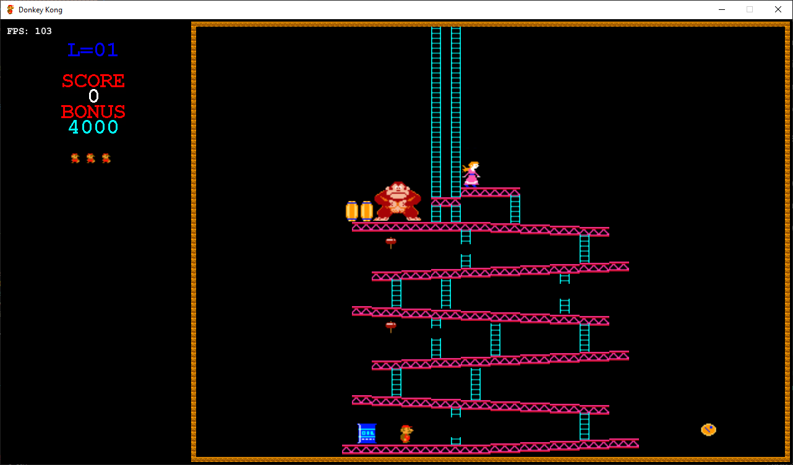
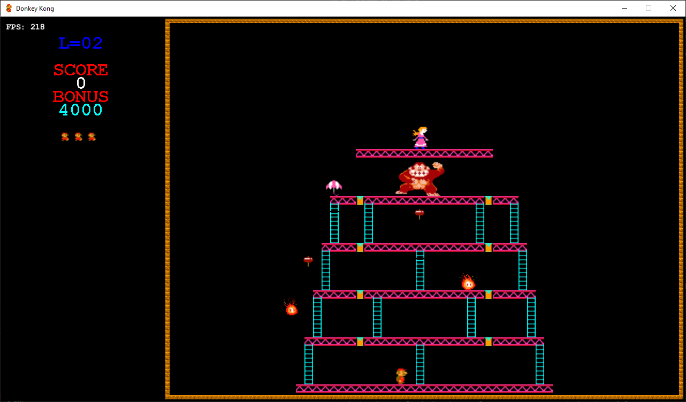
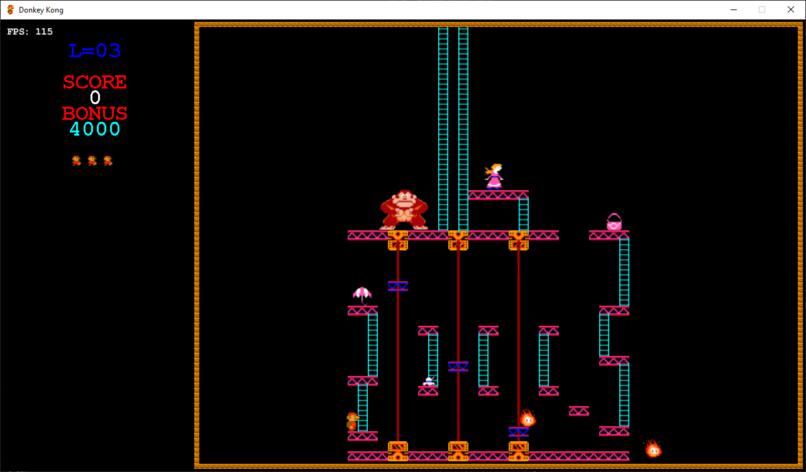
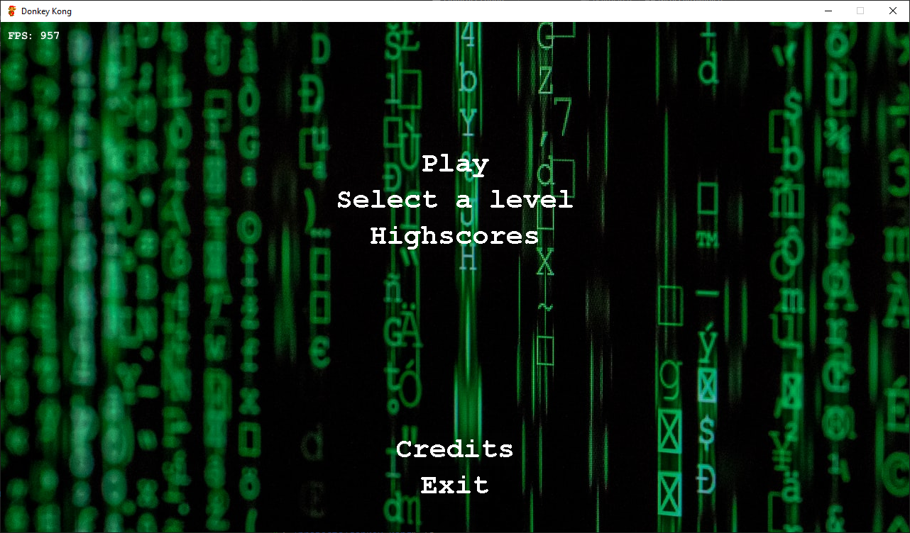
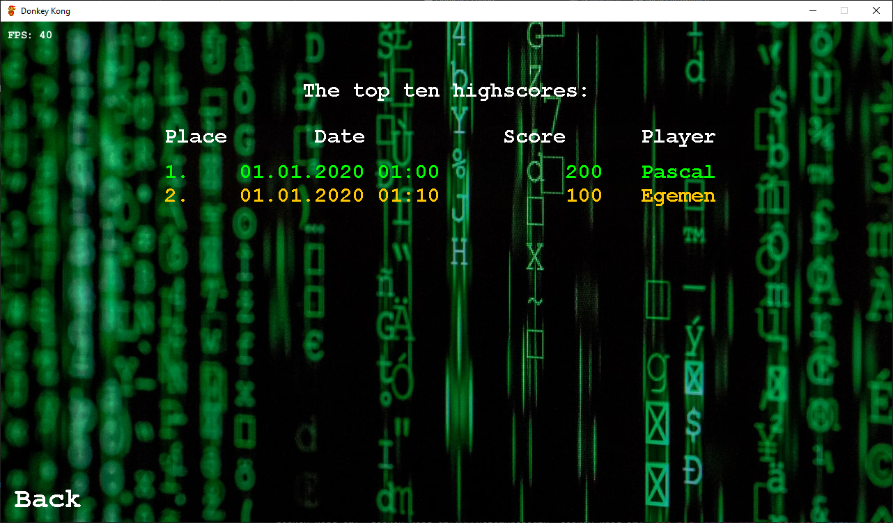

# Donkey Kong – Java Remake
This project is a modern Java-based remake of the classic Donkey Kong arcade game, developed as part of the Java Spiele Framework lecture at TU Darmstadt.
Built using LWJGL, Slick2D, and a custom game library provided during the course, the game faithfully recreates the retro platformer experience.

This game was developed collaboratively by me and Egemen Ulutürk as part of a university project.
Due to the constraints of the provided framework, certain design and implementation choices were limited — but we embraced the challenge!

> Note: All original game assets (e.g., sprites, backgrounds) have been removed from the repository due to legal reasons but I included some screenshots at the end.

> Note: This repository is not the original version used during development. It was originally hosted on a GitLab instance provided by our university. As a result, the full Git history is not available.

The project focuses on core game development principles including:
- 2D platformer mechanics
- Collision detection and player movement
- Sprite animation and level design
- Game state management
- Custom game levels (unfortunately without a level-builder)

Technologies Used
- Java 21
- LWJGL – Lightweight Java Game Library
- Slick2D – 2D game library built on LWJGL
- Custom Framework EEA – Provided by course instructors

# 🎮 Screenshots

